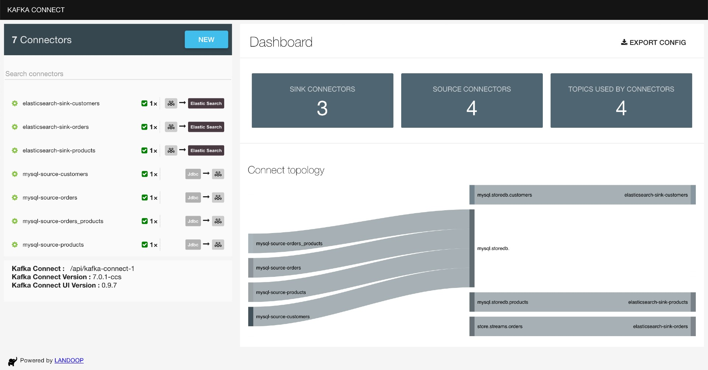

# springboot-kafka-connect-jdbc-streams

The main goal of this project is to play with [`Kafka`](https://kafka.apache.org), [`Kafka Connect`](https://docs.confluent.io/current/connect/index.html) and [`Kafka Streams`](https://docs.confluent.io/current/streams/index.html). For this, we have: `store-api` that inserts/updates records in [`MySQL`](https://www.mysql.com); `Source Connectors` that monitor inserted/updated records in `MySQL` and push messages related to those changes to `Kafka`; `Sink Connectors` that listen messages from `Kafka` and insert/update documents in [`Elasticsearch`](https://www.elastic.co); finally, `store-streams` that listens messages from `Kafka`, treats them using `Kafka Streams` and push new messages back to `Kafka`.

## Proof-of-Concepts & Articles

On [ivangfr.github.io](https://ivangfr.github.io), I have compiled my Proof-of-Concepts (PoCs) and articles. You can easily search for the technology you are interested in by using the filter. Who knows, perhaps I have already implemented a PoC or written an article about what you are looking for.

## Additional Readings

- \[**Medium**\] [**Streaming MySQL changes to Elasticsearch using Kafka Connect**](https://medium.com/@ivangfr/streaming-mysql-changes-to-elasticsearch-using-kafka-connect-fe22a5d0aa27)
- \[**Medium**\] [**Enhancing a MySQL-KafkaConnect-Elasticsearch Setup with Spring Boot Applications**](https://medium.com/@ivangfr/enhancing-a-mysql-kafkaconnect-elasticsearch-setup-with-spring-boot-applications-257c65ff0965)

## Project Diagram


## Applications

- ### store-api

  Monolithic [`Spring Boot`](https://docs.spring.io/spring-boot/docs/current/reference/htmlsingle/) application that exposes a REST API to manage `Customers`, `Products` and `Orders`. The data is stored in `MySQL`.
  
  

- ### store-streams

  `Spring Boot` application that connects to `Kafka` and uses `Kafka Streams API` to transform some _"input"_ topics into a new _"output"_ topic in `Kafka`.

## Prerequisites

- [`Java 17+`](https://www.oracle.com/java/technologies/downloads/#java17)
- [`Docker`](https://www.docker.com/)

## (De)Serialization formats

In order to run this project, you can use [`JSON`](https://www.json.org) or [`Avro`](https://avro.apache.org/docs/current/gettingstartedjava.html) format to serialize/deserialize data to/from the `binary` format used by Kafka. The default format is `JSON`. Throughout this document, I will point out what to do if you want to use `Avro`.

## Start Environment

- Open a terminal and inside `springboot-kafka-connect-jdbc-streams` root folder run:
  ```
  docker compose up -d
  ```
  > **Note**: During the first run, an image for `kafka-connect` will be built, whose name is `springboot-kafka-connect-jdbc-streams_kafka-connect`. Run the command below to rebuild it.
  > ```
  > docker compose build
  > ```

- Wait for all Docker containers to be up and running. To check it, run:
  ```
  docker compose ps
  ```
  
## Create Kafka Topics

In order to have topics in `Kafka` with more than `1` partition, we have to create them manually and not let the connectors to create them for us. So, for it:

- Open a new terminal and make sure you are in `springboot-kafka-connect-jdbc-streams` root folder;

- Run the script below:
  ```
  ./create-kafka-topics.sh
  ```

  It will create the topics `mysql.storedb.customers`, `mysql.storedb.products`, `mysql.storedb.orders`, `mysql.storedb.orders_products` with `5` partitions.

## Create connectors

Connectors use `Converters` for data serialization and deserialization. If you are configuring `For JSON (de)serialization`, the converter used is `JsonConverter`. On the other hand, the converter used is `AvroConverter`.

> **Important**: if the `Source Connector Converter` serializes data, for instance, from `JSON` to `bytes` (using `JsonConverter`), then the `Sink Connector Converter` must also use `JsonConverter` to deserialize the `bytes`, otherwise an error will be thrown. The document [Kafka Connect Deep Dive – Converters and Serialization Explained](https://www.confluent.io/blog/kafka-connect-deep-dive-converters-serialization-explained) explains it very well.

Steps to create the connectors:

- In a terminal, navigate to `springboot-kafka-connect-jdbc-streams` root folder

- Run the following script to create the connectors on `kafka-connect`:

  - **For JSON (de)serialization**

    ```
    ./create-connectors-jsonconverter.sh
    ```
    
  - **For Avro (de)serialization**

    ```
    ./create-connectors-avroconverter.sh
    ```

- You can check the state of the connectors and their tasks on `Kafka Connect UI` or running the following script:
  ```
  ./check-connectors-state.sh
  ```

- Once the connectors and their tasks are ready (`RUNNING` state), you should see something like:
  ```
  {"name":"mysql-source-customers","connector":{"state":"RUNNING","worker_id":"kafka-connect:8083"},"tasks":[{"id":0,"state":"RUNNING","worker_id":"kafka-connect:8083"}],"type":"source"}
  {"name":"mysql-source-products","connector":{"state":"RUNNING","worker_id":"kafka-connect:8083"},"tasks":[{"id":0,"state":"RUNNING","worker_id":"kafka-connect:8083"}],"type":"source"}
  {"name":"mysql-source-orders","connector":{"state":"RUNNING","worker_id":"kafka-connect:8083"},"tasks":[{"id":0,"state":"RUNNING","worker_id":"kafka-connect:8083"}],"type":"source"}
  {"name":"mysql-source-orders_products","connector":{"state":"RUNNING","worker_id":"kafka-connect:8083"},"tasks":[{"id":0,"state":"RUNNING","worker_id":"kafka-connect:8083"}],"type":"source"}
  {"name":"elasticsearch-sink-customers","connector":{"state":"RUNNING","worker_id":"kafka-connect:8083"},"tasks":[{"id":0,"state":"RUNNING","worker_id":"kafka-connect:8083"}],"type":"sink"}
  {"name":"elasticsearch-sink-products","connector":{"state":"RUNNING","worker_id":"kafka-connect:8083"},"tasks":[{"id":0,"state":"RUNNING","worker_id":"kafka-connect:8083"}],"type":"sink"}
  {"name":"elasticsearch-sink-orders","connector":{"state":"RUNNING","worker_id":"kafka-connect:8083"},"tasks":[{"id":0,"state":"RUNNING","worker_id":"kafka-connect:8083"}],"type":"sink"}
  ```

- On `Kafka Connect UI` (http://localhost:8086), you should see:

  

- If there is any problem, you can check `kafka-connect` container logs:
  ```
  docker logs kafka-connect
  ```
## Running Applications with Maven

- **store-api**

  - Open a new terminal and make sure you are in `springboot-kafka-connect-jdbc-streams` root folder.
  
  - Run the command below to start the application:
    ```
    ./mvnw clean spring-boot:run --projects store-api -Dspring-boot.run.jvmArguments="-Dserver.port=9080"
    ```
    > **Note**
    >
    > It will create all tables, such as: `customers`, `products`, `orders` and `orders_products`. We are using `spring.jpa.hibernate.ddl-auto=update` configuration.
    > 
    > It will also insert some customers and products. If you don't want it, just set to `false` the properties `load-samples.customers.enabled` and `load-samples.products.enabled` in `application.yml`.

- **store-streams**

  - Open a new terminal and inside `springboot-kafka-connect-jdbc-streams` root folder.

  - To start application, run:

    - **For JSON (de)serialization**
  
      ```
      ./mvnw clean spring-boot:run --projects store-streams -Dspring-boot.run.jvmArguments="-Dserver.port=9081"
      ```
      
    - **For Avro (de)serialization**
    
      > **Warning**: Unable to run in this mode in my machine! The application starts fine when using `avro` profile but, when the 1st event arrives, the `org.apache.kafka.common.errors.SerializationException: Unknown magic byte!` is thrown. The problem doesn't happen while [Running Applications as Docker containers](#running-applications-as-docker-containers). 
    
      ```
      ./mvnw clean spring-boot:run --projects store-streams -Dspring-boot.run.jvmArguments="-Dserver.port=9081" -Dspring-boot.run.profiles=avro
      ```
      > The command below generates Java classes from Avro files present in `src/main/resources/avro`
      > ```
      > ./mvnw generate-sources --projects store-streams
      > ```

## Running Applications as Docker containers

### Build Application’s Docker Image

- In a terminal, make sure you are inside `springboot-kafka-connect-jdbc-streams` root folder;

- Run the following script to build the application's docker image:
  ```
  ./docker-build.sh
  ```

### Application’s Environment Variables

- **store-api**

  | Environment Variable   | Description                                                       |
  |------------------------|-------------------------------------------------------------------|
  | `MYSQL_HOST`           | Specify host of the `MySQL` database to use (default `localhost`) |
  | `MYSQL_PORT`           | Specify port of the `MySQL` database to use (default `3306`)      |

- **store-streams**

  | Environment Variable   | Description                                                             |
  |------------------------|-------------------------------------------------------------------------|
  | `KAFKA_HOST`           | Specify host of the `Kafka` message broker to use (default `localhost`) |
  | `KAFKA_PORT`           | Specify port of the `Kafka` message broker to use (default `29092`)     |
  | `SCHEMA_REGISTRY_HOST` | Specify host of the `Schema Registry` to use (default `localhost`)      |
  | `SCHEMA_REGISTRY_PORT` | Specify port of the `Schema Registry` to use (default `8081`)           |

### Run Application’s Docker Container

- In a terminal, make sure you are inside `springboot-kafka-connect-jdbc-streams` root folder;

- In order to run the application's docker containers, you can pick between `JSON` or `Avro`:

  - **For JSON (de)serialization**
    ```
    ./start-apps.sh
    ```
  - **For Avro (de)serialization**
    ```
    ./start-apps.sh avro
    ```

## Application's URL

| Application   | URL                                   |
|---------------|---------------------------------------|
| store-api     | http://localhost:9080/swagger-ui.html |
| store-streams | http://localhost:9081/actuator/health |

## Testing

1. Let's simulate an order creation. In this example, customer with id `1`
   ```
   {"id":1, "name":"John Gates", "email":"john.gates@test.com", "address":"street 1", "phone":"112233"}
   ```
   will order one unit of the product with id `15`
   ```
   {"id":15, "name":"iPhone Xr", "price":900.00}
   ```

   In a terminal, run the following `curl` command:
   ```
   curl -i -X POST localhost:9080/api/orders \
     -H 'Content-Type: application/json' \
     -d '{"customerId": 1, "paymentType": "BITCOIN", "status": "OPEN", "products": [{"id": 15, "unit": 1}]}'
   ```

   The response should be:
   ```
   HTTP/1.1 201
   {
     "id": "47675629-4f0d-440d-b6df-c829874ee2a6",
     "customerId": 1,
     "paymentType": "BITCOIN",
     "status": "OPEN",
     "products": [{"id": 15, "unit": 1}]
   }
   ```

2. Checking `Elasticsearch`:
   ```
   curl "localhost:9200/store.streams.orders/_search?pretty"
   ```
   
   We should have one order with a customer and products names:
   ```
   {
     "took" : 844,
     "timed_out" : false,
     "_shards" : {
       "total" : 1,
       "successful" : 1,
       "skipped" : 0,
       "failed" : 0
     },
     "hits" : {
       "total" : {
         "value" : 1,
         "relation" : "eq"
       },
       "max_score" : 1.0,
       "hits" : [
         {
           "_index" : "store.streams.orders",
           "_type" : "order",
           "_id" : "47675629-4f0d-440d-b6df-c829874ee2a6",
           "_score" : 1.0,
           "_source" : {
             "payment_type" : "BITCOIN",
             "created_at" : 1606821792360,
             "id" : "47675629-4f0d-440d-b6df-c829874ee2a6",
             "customer_name" : "John Gates",
             "customer_id" : 1,
             "status" : "OPEN",
             "products" : [
               {
                 "unit" : 1,
                 "price" : 900,
                 "name" : "iPhone Xr",
                 "id" : 15
               }
             ]
           }
         }
       ]
     }
   }
   ```

3. In order to create random orders, we can use also the `simulation`:
   ```
   curl -i -X POST localhost:9080/api/simulation/orders \
     -H 'Content-Type: application/json' \
     -d '{"total": 10, "sleep": 100}'
   ```

## Useful Links/Commands

- **Kafka Topics UI**

  `Kafka Topics UI` can be accessed at http://localhost:8085

- **Kafka Connect UI**

  `Kafka Connect UI` can be accessed at http://localhost:8086

- **Schema Registry UI**

  `Schema Registry UI` can be accessed at http://localhost:8001

- **Schema Registry**

  You can use `curl` to check the subjects in `Schema Registry`

  - Get the list of subjects
    ```
    curl localhost:8081/subjects
    ```
  - Get the latest version of the subject `mysql.storedb.customers-value`
    ```
    curl localhost:8081/subjects/mysql.storedb.customers-value/versions/latest
    ```

- **Kafka Manager**

  `Kafka Manager` can be accessed at http://localhost:9000

  _Configuration_
  - First, you must create a new cluster. Click on `Cluster` (dropdown on the header) and then on `Add Cluster`;
  - Type the name of your cluster in `Cluster Name` field, for example: `MyCluster`;
  - Type `zookeeper:2181` in `Cluster Zookeeper Hosts` field;
  - Enable checkbox `Poll consumer information (Not recommended for large # of consumers if ZK is used for offsets tracking on older Kafka versions)`;
  - Click on `Save` button at the bottom of the page.

- **Elasticsearch**

  `Elasticsearch` can be accessed at http://localhost:9200

  - Get all indices:
    ```
    curl "localhost:9200/_cat/indices?v"
    ```
  - Search for documents:
    ```
    curl "localhost:9200/mysql.storedb.customers/_search?pretty"
    curl "localhost:9200/mysql.storedb.products/_search?pretty"
    curl "localhost:9200/store.streams.orders/_search?pretty"
    ```

- **MySQL**

  ```
  docker exec -it -e MYSQL_PWD=secret mysql mysql -uroot --database storedb
  select * from orders;
  ```
  
## Shutdown

- To stop applications:
  - If they were started with `Maven`, go to the terminals where they are running and press `Ctrl+C`;
  - If they were started as Docker containers, go to a terminal and, inside `springboot-kafka-connect-jdbc-streams` root folder, run the script below:
    ```
    ./stop-apps.sh
    ```
- To stop and remove docker compose containers, network and volumes, go to a terminal and, inside `springboot-kafka-connect-jdbc-streams` root folder, run the following command:
  ```
  docker compose down -v
  ```

## Cleanup

To remove the Docker images created by this project, go to a terminal and, inside `springboot-kafka-connect-jdbc-streams` root folder, run the script below:
```
./remove-docker-images.sh
```

## Issues

- Product `price` field, [numeric.mapping doesn't work for DECIMAL fields #563](https://github.com/confluentinc/kafka-connect-jdbc/issues/563). For now, the workaround is using `String` instead of `BigDecimal` as type for this field.

## References

- https://cloud.spring.io/spring-cloud-static/spring-cloud-stream-binder-kafka/current/reference/html/spring-cloud-stream-binder-kafka.html#_kafka_streams_binder
- https://github.com/spring-cloud/spring-cloud-stream-samples/tree/master/schema-registry-samples
- https://www.confluent.io/blog/simplest-useful-kafka-connect-data-pipeline-world-thereabouts-part-1 (2 and 3)
- https://www.confluent.io/blog/kafka-connect-deep-dive-converters-serialization-explained
